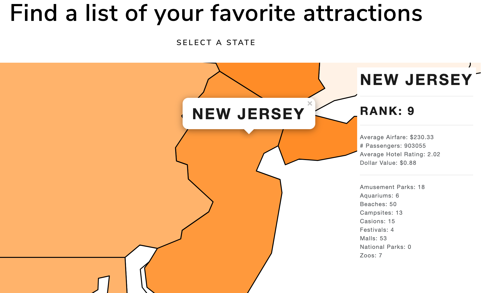
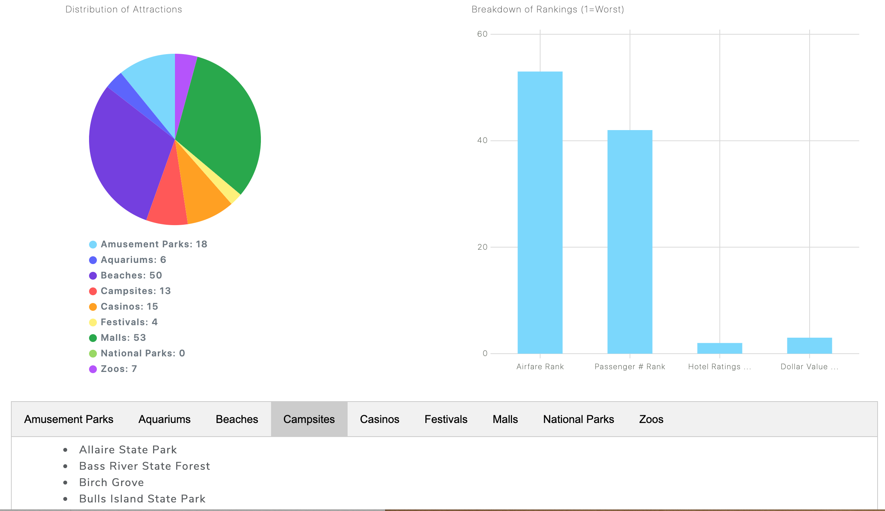

# Find Your Destination

## Summary
We have created a map with an interactive dashboard for anyone looking to decide which state to travel to. Our webpage provides you a choropleth on the most popular states to travel to based on a equation created by our group. By clicking on each state, you can find information on various attractions offered, average flight costs and the value of your money there. Explore the map to find your ideal destination right at your footsteps!

## Group Members
* Solito Reyes
* Kasia Kalemba
* Shrilekha Vijayakanthan
* Sandra Froonjian

## Motivation
This app was created during the Covid pandemic, when Americans were not allowed to travel outside of the US, so why not find the perfect destination in your own country? With so many options of places to travel to even just within the US, it can be overwhelming to decide where to go for your vacation. This app can help you decide by displaying various charts with information related to each state's attractions, airfare, hotel ratings, and dollar value.

### Data Collected

## Sources
* Flights: Travel cost per destination & amount of passengers 
  [United States Department of Transportation]
  (https://www.transtats.bts.gov/AverageFare/)
  * USED INSERT WHICH YEAR AND DATASET.
* Hotel Rankings 
  [Datafiniti's Business Database]
  (https://www.kaggle.com/datafiniti/hotel-reviews?select=Datafiniti_Hotel_Reviews.csv)
  * USED INSERT WHICH PART OF DATASET
* Attractions based on the state [Wikipedia]
  (https://en.wikipedia.org/wiki/Tourist_attractions_in_the_United_States)
  * Scraped this page to extract info for: Casinos, National Parks, Aquariums, Zoos, Festivals, Amusement Parks, Beaches, Malls, Campsites
* Campground Locations [DataWorld]
  (https://data.world/caroline/campgrounds)
  * USED INSERT WHICH
* Value of dollar based on state [USA Today]
  (https://www.usatoday.com/story/money/2019/05/25/us-dollar-how-much-its-worth-value-in-every-state/39501091/)
  * Scraped the website to extract the value matched with the state

---

## Workflow
### Step 1: Extract Data
* Downloaded data as csvs or scarped it from webpages such as Wikipedia and USA News 
* Downloaded geoJson dataset for state boundaries from Mike Bostock's public file

### Step 2: Clean Data and Enter into Database
* Using Jupyter Notebook, we loaded the data from CSV's to visualize it and clean it up
* Using Jupyter Notebook, we scraped the attraction data from Wikipedia and converted it to CSV files
* Using QuickDB, developed code for Postgres table set up 
* Created tables for ustravelapp_db and made a custom ranking list for each state

### Step 3: Flask App
* Using an app.py file for the Flask App

### Step 3: Render Data
* HTML & CSS Files
  * index.html: main webpage used for the website
  * style.css: custom css file to use for styling of select objects
  * bootstrap.min.css: bootstap theme and styling used for Bootstrap features 

* Javascript Files:
  * logic.js: primary file to launch our interactive page
  * config.js: insert API key for rendering of map objects

  Javascript Packages used:
  * Mapbox
  * Leaflet
  * d3

## System Requirements
* certifi==2020.6.20
* click==7.1.2
* Flask==1.1.2
* Flask-SQLAlchemy==2.4.3
* gunicorn==20.0.4
* itsdangerous==1.1.0
* Jinja2==2.11.2
* MarkupSafe==1.1.1
* SQLAlchemy==1.3.18
* Werkzeug==1.0.1
* wincertstore==0.2
* psycopg2==2.8.4

## Steps to run the application
**Option 1**
1. View the page at our URL: [https://findyourdestinations.herokuapp.com/](https://findyourdestinations.herokuapp.com/)
**Option 2**
1. Save all of the files of the repository to a local folder on your computer.
1. Open PgAdmin and create a new database called "ustravelapp_db"
1. In the query editor, run the text in the file db_script.txt, which is in the data folder
1. Open Jupyter Notebook and run all the cells of the file ustravelapp.ipynb
1. In your PgAdmin editor, run the text in the file db_script2.txt, which is in the data folder
1. Open your terminal and cd into the folder you saved all the files in.
1. Run the command "python app.py"
1. In your brower, go to your local host (usually http://localhost:5000/)
